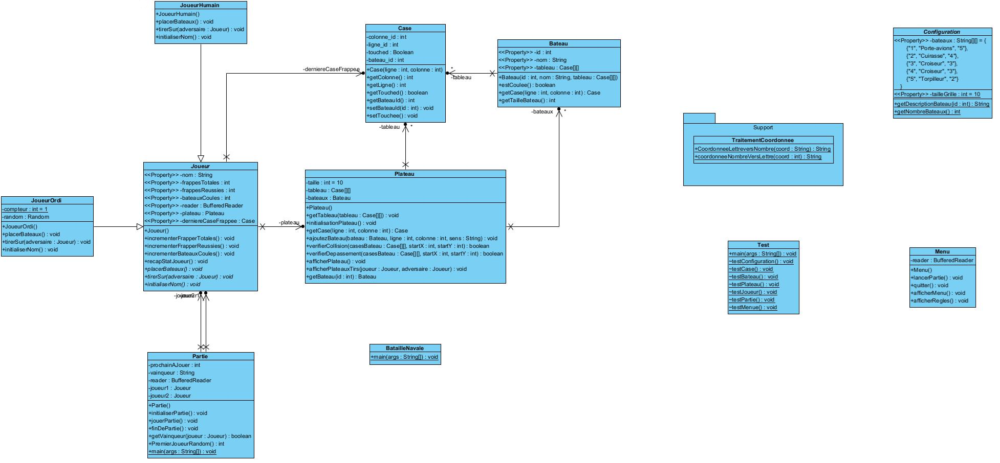

# Bataille Navale

## Introduction
Projet MOOB 2024-2025 Bataille Navale


## Lancement
Pour exécuter le jeu, suivez les étapes ci-dessous :

```bash
make test ou make run
```


## Explication
Je suis débutant sur l'utilisation de git donc j'ai souvent pu oublier de faire certains commit, ou qu'ils soient incomplets. J'ai eu de gros problème avec github et son utilisation, donc j'ai deux repo : 

Dêpot fonctionnel : https://github.com/BySyto/BatailleNavalTpJava.git
Ce dêpot est mon projet fonctionnel, avec la bonne arborescence.

Dêpot commit : https://github.com/BySyto/BattleShip_MehdiSoukker.git
Ce dêpot est celui ou j'ai principalement travaillé et ou j'ai fais mes commits. N'ayant pas la bonne arborescence, j'ai préféré en avoir un autre propre.


Pour ma classe Plateau, j'ai fait en sorte que chaque bâteau à un plateau, ce qui permettrais de pouvoir gèrer la taille (longueur/largeur) du bateau plus tard, si il y a besoin.


## Diagramme


## Auteurs
- Mehdi Soukker